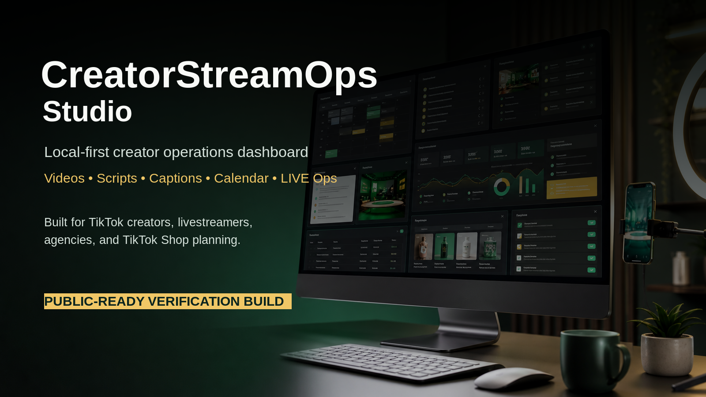

# CreatorStreamOps Studio



CreatorStreamOps Studio is a local-first full-stack operations platform for TikTok creators, TikTok LIVE streamers, TikTok Shop sellers, musicians, educators, influencers, agencies, small businesses, and community groups.

It helps creators plan short-form videos, write structured scripts, draft captions and hashtags, schedule content, prepare livestream run-of-show plans, organize moderation checklists, track analytics manually, and generate Markdown reports after campaigns and LIVE sessions.

## Who It Is For

- TikTok creators and livestreamers
- TikTok Shop sellers and small businesses
- Musicians, artists, educators, podcasters, and community teams
- Influencers, agencies, and social media managers

## Problems It Solves

- Scattered video ideas, captions, scripts, and posting plans
- Unprepared LIVE sessions with missing moderation and technical checks
- Manual analytics trapped in notes or spreadsheets
- Weak post-LIVE follow-up and campaign reporting
- Unsafe temptation to use fake engagement or unofficial automation

## What It Does

- Creator profile management
- Video idea bank
- Script builder
- Caption and hashtag workspace with basic text risk checklist
- Content calendar
- Livestream planning
- Run-of-show segment builder
- Moderation preparation checklist
- OBS / TikTok LIVE Studio readiness checklist
- TikTok Shop and live-selling planning
- Manual analytics tracking
- Post-LIVE, campaign, weekly, video, and LIVE Markdown reports
- Audit logging
- Local admin authentication with bcrypt and HTTP-only session cookie

## What It Does Not Do

CreatorStreamOps Studio does not automate fake engagement. It does not auto-like, auto-comment, generate followers, create view bots, manipulate gifts, scrape TikTok, bypass LIVE eligibility, download copyrighted media, mass-message users, steal credentials, or post to TikTok in the MVP.

Official API-ready placeholders may be added later only through documented, user-approved integrations.

## Tech Stack

- Programming language: TypeScript
- Frontend: React, Vite, lucide-react, CSS
- Backend: Node.js, Express, Zod
- Auth: bcrypt password verification, HTTP-only local session cookie
- Storage: local JSON with atomic writes
- Testing: Vitest

## Local Setup

```bash
npm install
cp .env.example .env
npm run build
npm start
```

Open `http://127.0.0.1:4177`.

Demo local credentials:

- Username: `admin`
- Password: `creatorstreamops-demo`

The demo password is for local testing only. Change it before real use.

## Development

```bash
npm run dev
npm run server
```

The Vite dev server proxies `/api` to the local backend.

## Tests And Checks

```bash
npm audit --audit-level=moderate
npm run typecheck
npm run lint
npm run format
npm test
npm run build
npm run scan:secrets
```

## Generate Reports

Reports are generated through the authenticated app or API:

- `POST /api/reports/video/:ideaId`
- `POST /api/reports/live/:liveId`
- `POST /api/reports/post-live/:liveId`
- `POST /api/reports/weekly`
- `POST /api/reports/campaign`

Reports are Markdown records stored in local JSON data.

## Public GitHub / Codeberg Readiness Process

Before publishing:

1. Run all checks listed above.
2. Confirm `.env`, `data/`, `dist/`, logs, and `node_modules/` are not committed.
3. Run `npm run scan:secrets`.
4. Review `docs/PLATFORM_BOUNDARIES.md`.
5. Confirm no fake engagement, scraping, mass messaging, or credential collection features exist.
6. Commit only passing, portable, buyer-safe files.

## Storage Notes

The MVP uses local JSON with atomic file replacement. This is simple and portable for buyers. For multi-user or hosted use, migrate to SQLite, PostgreSQL, or a Supabase-compatible schema.
